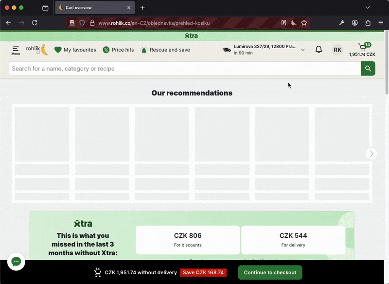

💪 🥐 Brohlik – Split Your Rohlik Cart

Brohlik is a Firefox extension that lets you split your shared Rohlik.cz grocery cart with flatmates, partners, or your picky friend. Add items, assign them to different people with one click, and track individual totals in a popup view. It is currently a WIP!

✨ What It Does

When you're shopping on rohlik.cz, Brohlik:

- 🛒 Hooks into the cart page in real-time.

- 👥 Adds a little toggle button to each cart item so you can assign it to a specific user or make it a 'Shared' item

- 💰 Tracks costs for each user.

- 🧮 Gives you a neat cost breakdown via the browser popup.

❌ No more spreadsheets or manual calculations!

🧩 Local Installation (until publication)

`git clone https://github.com/rkraeher/brohlik.git`

🦊 In Firefox:

- Go to about:debugging

- Click "This Firefox" > "Load Temporary Add-on..."

- Choose any file in the brohlik/ directory (e.g. manifest.json)

- Head to rohlik.cz, open your cart, and start assigning!

🐢 Made by [@rkraeher](https://github.com/rkraeher) in Prague, for flatmates and brohlíky.

